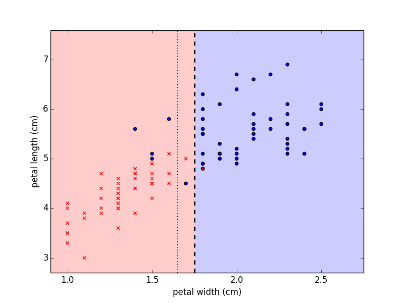
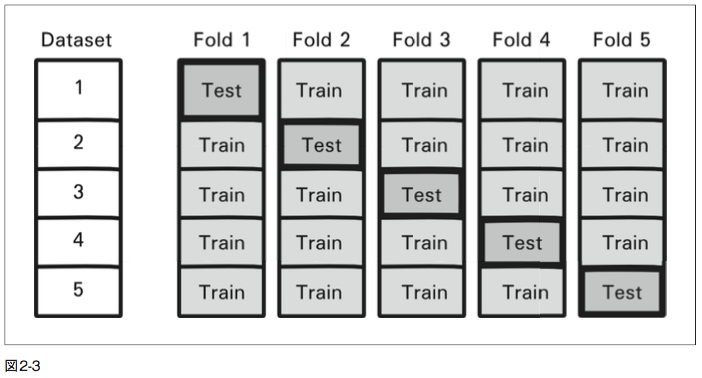
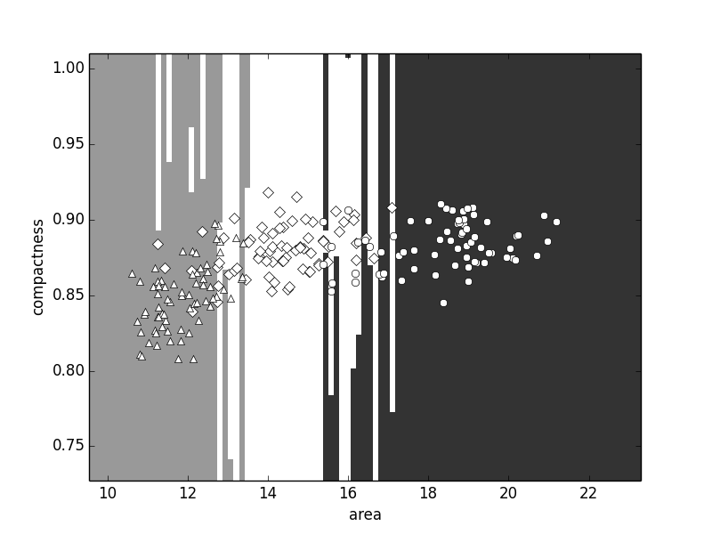
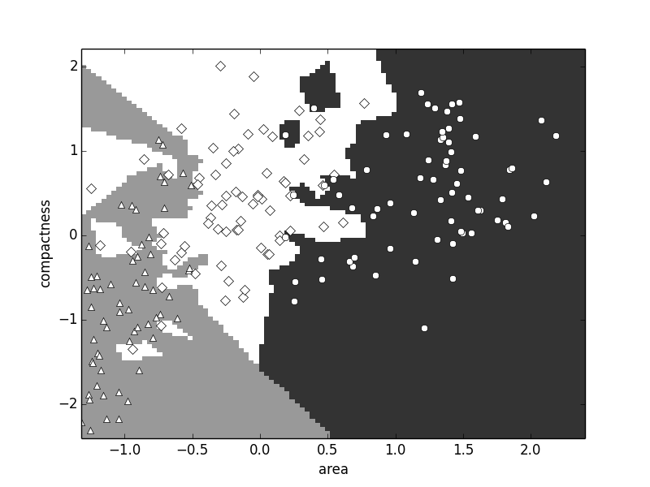

# Building Machine Learning System with Python

# 実践 機械学習

## 2 実例を対象とした分類法入門

- 花の写真からその花の品種を言い当てたい。
- 機械学習の観点から次のようなアプローチを取れる。
	- まず品種別に花の画像を用意して、コンピュータにルールを学習させる。
	- そして品種の分からない画像に対して、学習したルールを用いて分類を行う。
- クラス分類（classification）または教師あり学習（supervised learning）と呼ばれる。
- 本章の目標はクラス分類について基本的な原理を理解すること。

## 2.1 アイリスデータセット

- 1930年代からある伝統的なデータセット。
- アイリストは花の名前で、日本では「アヤメ」とも呼ばれる。
- よく使われるサンプルデータのひとつ。
- 中身はアイリスという花に関するもので、3つの異なる品種のサンプルデータ。
- サンプル数は150で、特徴量は4つ。
- 特徴量（features）は以下の4つ：
	- がく片の長さ（Sepal length）
	- がく片の幅（Sepal width）
	- 花弁の長さ（Petal length）
	- 花弁の幅（Petal width）

### 2.1.1 可視化から始める

- データが小さいので、全ての点を描画できる。
- 2次元のグラフに描画する場合、軸として採用する特徴量の組み合わせもすべて描画できる。
- まずはグラフ化してデータについての感覚を掴む。（図2−1）
	- ▲：Setosa
	- ●：Versicolor
	- ×：Virginica
- 大きく2グループに分割できそう。

```python
from matplotlib import pyplot as plt
from sklearn.datasets import load_iris
import numpy as np

data = load_iris()

feats = data['data']
feat_names = data['feature_names']
target = data['target']
target_names = data['target_names']
labels = target_names[target] # さらっとやってるけど、これが結構すごい

for t, marker, c in zip(xrange(3), '>ox', 'rgb'):
    # クラスごとに色の異なるマーカでプロット
    plt.scatter(feats[target == t, 0],
                feats[target == t, 1],
                marker=marker,
                c=c)
```


### 2.1.2 はじめての分類モデル作成

- 「花弁の長さ」を使って Setosa と他の品種を見分けれそう。
- 次のコードで境界線を見つける。

```python
# 「花弁の長さ」は配列の3番目に格納されてる
plength = feats[:, 2]
is_setosa = (labels == 'setosa')

# 重要なステップ
max_setosa = plength[is_setosa].max() # setosa である花弁の長さの中で一番大きいもの
min_non_setosa = plength[~is_setosa].min() # setosa でない花弁の長さの中で一番小さいもの
print 'Maximum of setosa:', max_setosa
print 'Minimum of others:', min_non_setosa
```

- setosa の花弁長の最大値は 1.9、他の2品種の花弁長の最小値は 3.0 であることがわかった。
- よって、「もし花弁の長さが 2 より小さければ、それは Setosa という品種のアイリスであり、それ以外であれば、それは Virginica か Versicolor という品種のアイリスである」という単純なモデルを作れる。

```python
def apply_model(example):
    if example[2] < 2: print 'Iris Setosa'
    else: print 'Iris Virginica or Iris Versicolor'
```

- 一つの次元において閾値を定めただけだが、Setosa について誤りなく分類することができる。
- しかし他の2つについては、最適な閾値は簡単には見つけられない。
- まず Setosa 以外の特徴量トラベルを選ぶ。

```python
feats = feats[~is_setosa]
labels = labels[~is_setosa]
virginica = (labels == 'virginica')
```

- 次に、すべての特徴量とその閾値の組み合わせについて正解率（accuracy）を計算し、最も高い組み合わせを見つけたい。

```python
best_acc = -1.
best_fi  = -1.
best_t   = -1.

for fi in xrange(feats.shape[1]):
    # 各特徴量ごとに閾値の候補を生成
    thresh = feats[:, fi].copy()
    thresh.sort()
    
    # すべての閾値でテスト
    for t in thresh:
        pred = (feats[:, fi] > t)
        acc = (labels[pred] == 'virginica').mean()
        if acc > best_acc:
            best_acc = acc
            best_fi = fi
            best_t = t
```

- `pred` は各サンプルデータが virginica であるかどうかを示す予測結果でブーリアン型の配列。
- そしてこの配列の `True` である要素のラベル名を正解ラベル名である `virginica` と比較。
- ここで、ブーリアン型配列の平均（`mean`）を取ることで、ブーリアン型配列の `True` の割合を求められる。
- `for`ループの最後ですべての閾値と特徴量の組み合わせでテストが行われ、より適した値が格納される。
- また、新しいデータに対して、このモデルを適用するためには次のようにする。

```python
def apply_model(example):
	if example[best_fi] > best_t: print 'virginica'
	else: print 'versicolor'
```

- このモデルは上手く分類することができるのか。
- すべてのデータを対象に上のコードを実行すると、最適なモデルは「花弁の幅」について分類するモデルであることがわかる。
- 図2−2の左（赤）は Virginica で右（青）は Versicolor。
- 閾値を用いるモデルで決定境界（decision boundary）は常にひとつの軸に対して平行な直線になる。
- 同じ正解率で分類できる閾値はもうひとつある（点線）。



#### 保持データと交差検定で評価を行う

- 前節でのモデルは単純で、訓練データの94%を正しく分類できる。
- が、評価を行うために用いたデータは、閾値を決定するために用いた訓練データと同じ。
- これでは汎化能力（generalization ability）について正しく評価できない。
- そこで交差検定（cross-validation、leave-one-out法とも呼ばれる）をつかって検定を行う。

```python
# cross-validation
error = 0.
for ei in range(len(feats)):
    # ei 番目を除いたデータを用いて訓練
    training = np.ones(len(feats), bool)
    training[ei] = False
    testing = ~training
    model = learn_model(feats[training], virginica[training])
    predictions = apply_model(feats[testing], virginica[testing], model)
    error += np.sum(predictions != virginica[testing])
```



## 2.2 更に複雑なクラス分類機の作成

- 前節では単純な、一つの次元に対して閾値を用いるモデルを使用した。
- 他にも様々なタイプのモデルがある。
- さて、クラス分類モデルを構成している要素はなにか。これは次の3つに分けることができる。
	- モデル構造：ここではある1つの特徴量に対する閾値を用いた。
	- 探索アルゴリズム：ここでは特徴量と閾値のすべての組み合わせを試行し、最適な組み合わせを選んだ。
	- 損失関数：損失関数を用いることで、より**悪くない**モデルを選択できる。訓練誤差を用い、これをひとつの到達点とすることで、最適な正解率に到達できたか、判断の1つとして考えることができる。一般的に、損失関数を最小にするような手法について考えることになる。
- 上の3つの要素を変更することで、異なる結果が得られる。
- たとえば、訓練誤差を最小にする閾値を求めるような場合、各特徴量について次の3つの値だけテストすることで、閾値を求めることができる。
	- 特徴量の平均値
	- 平均値に標準偏差を1つ足した値
	- 平均値に標準偏差を1つ引いた値
- これは処理が重たい場合に効果的（また、データの数が億を超える場合など）
- 先ほど用いた、全ての特徴量と閾値の組み合わせをチェックする「力まかせ探索」は現実的ではない場合が多く、そのときは今述べたような近似的な手法を用いなければならないだろう。

## 2.3 より複雑なデータセットとクラス分類

### 2.3.1 種データセットを学習する

- ここでは、農業に関する（小麦の種）データセットを見ていく。
- データ数は少ないが、アイリスデータセットで行ったような全ての特徴量の組み合わせをプロットするには、特徴量の数が多すぎる。
- 次の7つの特徴量がある。
	- 面積（$A$）
	- 周囲長さ（$P$）
	- 密集度（$C=4 \pi A / P^2$）
	- 長さ
	- 幅
	- 非対称係数
	- 殻溝の長さ
- データセットには3つの品種の小麦がある。
	- カナダ産
	- コマ産
	- ロサ産

### 2.3.2 特徴量と特徴エンジニアリング

- 「密集度」という特徴量は新たに計測されたデータではなく、他の特徴量である「面積」と「周囲長さ」から計算されたもの。
- 特徴エンジニアリング(feature engineering)と呼ばれるテーマで行われること。
- 機械学習において、特徴エンジニアリングよりアルゴリズムのほうが魅力的に見られがちだが、システム性能に大きな影響を及ぼすのは、特徴エンジニアリングのほう。
- 「良い特徴量」とはどういったものか？それは次の2つの条件を同時に満たす特徴量と言える。
	- 重要なことには敏感に反応すること
	- 重要でないことには反応を示さないこと
- たとえば、「密集度」については、小麦全体の大きさが変わっても密集度は変化しないが、形状が変わると密集度は変化する。

### 2.3.3 最近傍法

- 最近傍法（Nearest neighbor classification）
- 各データが、その特徴ベクトルによって表現されていると考える。
- すると、データ間の距離を計算することができる。
- 距離を計算する方法にはいくつかある（ユークリッド距離、マンハッタン距離など）

```python
def distance(p0, p1):
	# ユークリッド距離を計算
	return np.sum( (p0 - p1) ** 2 )
```

- ここでは、次の単純なルールを用いて分類を行う。
	- 新しいデータが与えられたる
	- そのデータに最も近い点（最近傍点）をデータセットから探索
	- その最近傍点のラベルを結果とする

```python
def nn_classify(training_set, training_labels, new_example):
	dists = np.array([ distance(t, new_example) for t in training_set ])
	nearest = dists.argmin()
	return training_labels[nearest]
```

- この場合、ここで使用するモデルは訓練データとそのラベルを全て保持。
- そして、新しいデータが入力されたとき、つまり、**分類時**に全ての計算を行う。
- 10分割交差検定で88%の正解率。
- 特徴量の中で、面積と密集度の二つを軸にとってグラフ化。



- カナダ産小麦がひし形、コマ産が円形、ロサ産が三角形でプロットされている。
- 各クラスが属する領域がそれぞれ白、黒、グレイに対応。
- ここでは、それぞれの軸を共通のスケールにするため、正規化(normalize)する必要がある。
- そのための手法は数多く存在します。単純な方法は、Z スコアを用いて正規化すること。
- Z スコアとは、平均からどれだけ離れているかということについて、標準偏差を基準として、求められる値。

```python
# 各特徴量からその平均値を引く
features -= features.mean(axis=0)
# 各特徴量をその標準偏差で割る
features /= features.std(axis=0)
```

- Z スコアを算出すれば、その値がもつ本来の意味とは独立して考えることができる。
- Z スコアが 0 のときは、そのデータが平均であり、正の値のときは平均より上であり、負の値のときは平均より下であることを意味する。



- 今度は、境界部分がより複雑になっているのがわかる。
- どちらの軸でも値が変われば、領域が変動するのがわかる(正規化前の図では、x 軸の値によって、属する領域が決まっていた)


## 2.4 二項分類と多項分類

- 本章で初めに紹介した分類器は、閾値によって分類を行う単純な分類器で、データの値が閾値より大きいかどうかによって、あるクラスかそれ以外かに分類するもの。
	- これを二項分類（binary classification）とよぶ
- 二つ目の分類器は最近傍法という手法を用いた。この手法は複数あるクラスの中からどれか一つを結果として出力するもの。
	- これを多項分類（multiclass classification）とよぶ
- 一般的に、二項分類を行う手法を設計するほうが、多項分類を行う手法を設計するよりも単純。
- しかし、多項分類を行う場合でも、その問題を二項分類からなる問題に分解することができる。


## 2.5 まとめ

- 本章では、単純な例を見ながら、一般的なコンセプトについて紹介した。
- クラス分類を行うことは、モデルを作成すために、サンプルデータから分類する法則を導き出すことを意味する。
- 訓練データで使用しなったデータを、テストデータとして用いなければならない。
- テストデータとしてデータを使い過ぎないために、交差検定が有効である。
- 特徴量を設計(選択)することは、機械学習のパイプラインにおける重要な要素の一つ。
- 次の章では、クラスラベルが与えられていない場合のクラス分類について見ていく。